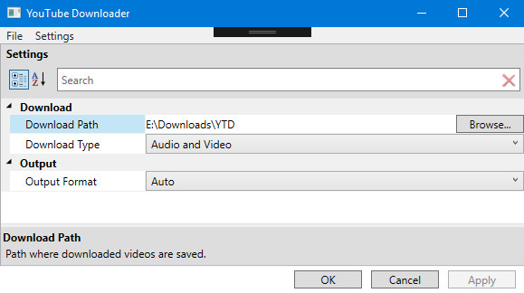

# YouTube Downloader
A user interface for [youtube-dl](https://github.com/ytdl-org/youtube-dl).

YouTube Downloader is an easy-to-use, YouTube video downloader, without pesky ads or malware.

This repository is archived, and thus will not receive further maintenance or edits.
The intent of this project was to create an interface to a command-line program for learning purposes.
This has been achieved.

## Core Functionality

### Query
- Query videos in one of six formats:
 1. Plain text search - returns the first result of querying the same string on YouTube
 2. Video URL - returns the exact video the URL points to
 3. Video ID - returns the exact video the ID points to
 4. Playlist video - returns all videos in the playlist of the video
 5. Playlist URL - returns all videos in the playlist the URL points to
 6. Playlist ID - returns all videos in the playlist the ID points to
- Receive detailed video information:
 1. Video thumbnail
 2. Video title
 3. Video publisher channel
 4. Video views
- Perform multiple queries at once, in parallel

### Download
- Select several videos from the matched videos section, and download them at once
- 3 concurrent downloads can be performed simultaneously
- Videos will be downloaded in the highest quality available, be it 1080p or 4k
- Receive detailed download progress information, such as the download speed and downloaded data
- Select and end downloads if necessary
- Pause downloads if necessary, allowing other downloads to download instead
- Resume downloads, which will be re-queued and continue downloading at the next available point

### Settings
- Choose where to download videos
- Choose audio-only downloads, or an audio-video combination
- Choose between default, MP4, or MP3 download formats (more to come soon!)

### Data Storage
- Restore the user session on launch, including the last query entered into the query box; the last set of videos matched; and all of the downloads that were queued or in progress in the last session

## Current Preview

### Main Interface

### Settings
